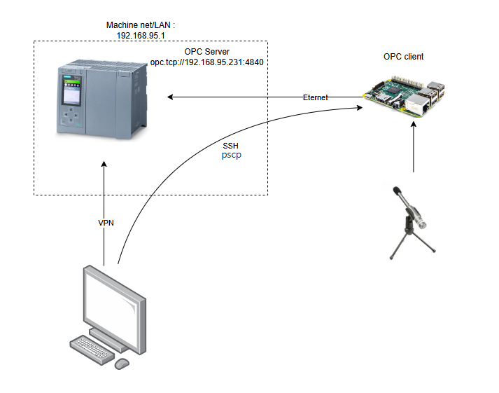

# audio_detection

Since I have worked with this project localy i have stored and tested loads of things with different audio files and different Convolutional Neural Network (CNN) models.
Also I have created scripts to collect data with different methods. And tried to implement semi-working CNN to collect data, with a better filter than amplitude threshold.
So I decided to be more structured and created this Repo for Anomaly detection with audio, re-trace my steps and keep track of my project changes.

## Folder Structure
 1. audiofiles 	- Includes all the audio data. the wav-files are ignored so ask @AndersLemme for the data.
 2. model 	- Is the folder with the python scripts that creates the CNN-models.
 3. processing	- Contain all scripts for recording, segmentation of wav files or processing.
 4. images - Project images

## Requirements
 - Microphone
 - Decent CPU (I dont have specifics)
 - Python
	- librosa (python 3.10 or erlier version. Alternatively use torchaudio)
	- TensorFlow
	- matplotlib.pyplot
	- opcua (optinal)
	- wave
	- scipy (fft & wavfile)
	- numpy

# Script description

## Model
This folder contains scripts for training, running and actually also model preperation (store MFCC's).

- **au1.py**: This script is used to read trough wav files, convert them to MFCC's and store them in data.json.
- **au2.py**: This script reads the data.json and train a CNN model.keras to distinguish between pop and no-pop

## Processing
This folder contains python scripts for recording, preprocessing, segmentation and other scripts used for analysis.

### New scripts 
- **segmentation.py**: This script takes a wav file and segment all high amplitude sounds and store them in a segmented file (1s).
- **segmentation2.py**: This script takes multiple  wav file and segment all high amplitude sounds and store them in a segmented file (1s).

### Old scripts
- **auproc.py**: Audio processing, amplitude envilope, 0-crossing, RSME - ran on file 140g_run2_pop.wav)
- **liveAudio.py:** Records data until keyboardInterrupt and store wav file
- **augment.py:** This script takes data (folder) as input and creates 4 new augmented files with "AddGaussianNoise" function.
- **audio_img.py (lyd2.py)**: This script reads all wav files in a folder and saves an image of the wav file with its fft.
- **aurec.py:** This file is created for recording and saving files of aduio with a high amplitude. This uses connection to OPC UA to know when the machine is running to start/stop recording. 
- **audio_recording_RPI/aurec.py:** This file is same as aurec.py, but is modified to run on Raspberry PI and also has a service file in the same directory.

### aurec.py with raspberry PI system sketch
The image below show how the recording was setup with a raspberry PI.

# Notes of previous work.. (for myself)
locally:
Popop folder contains machine learning scipts and models.
 - I think that i used au1 for feature extraction and au2 for model training.

MFCC[0] represents the overall energy (sometimes excluded for CNNs to avoid energy bias).

---

