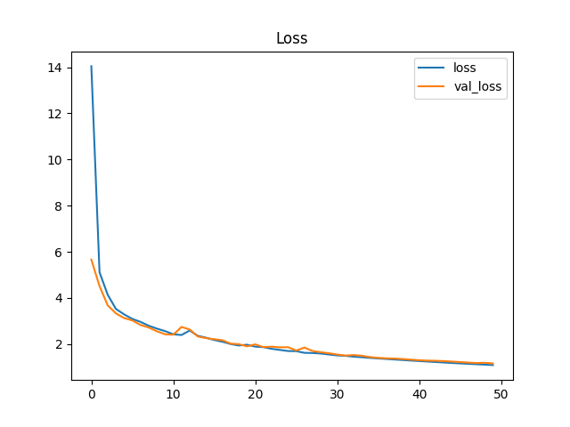

# Model description

The model files and figures are stored in the folder /models. The following chapters provide a detailed description of each model. The most recent test/model is presented in the first chapter, with older tests described in subsequent chapters further down this README.

## test3


## test2
I segmented the data once again because there was some audio files which didnt have audio all the way through the 1s wav files. 

### Configuration
- **Epochs** =  50
- **Batch_size** = 32
- **model** = Sequential()

### CNN Architecture

**Layer 1**
```python
model.add(Conv2D(32, (3, 3), input_shape=input_shape, padding='same'))
model.add(Activation("relu"))
model.add(MaxPooling2D(pool_size=(2, 2))) 
```
**Layer 2**
```python
model.add(Conv2D(64, (3, 3), padding='same'))
model.add(Activation("relu"))
model.add(MaxPooling2D(pool_size=(3, 3), strides=(2, 2), padding='same'))
```
**Layer 3**
```python
model.add(Conv2D(128, (3, 3), padding='same'))
model.add(Activation("relu"))
model.add(MaxPooling2D(pool_size=(3, 3), strides=(2, 2), padding='same'))
```
**Layer 4**
```python
model.add(Conv2D(256, (3, 3), padding='same'))
model.add(Activation("relu"))
model.add(MaxPooling2D(pool_size=(3, 3), strides=(2, 2), padding='same'))
```
**Dense Layer**
```python
model.add(Flatten())

model.add(Dense(256, kernel_regularizer=l2(0.01)))
model.add(Activation("relu"))
model.add(Dropout(0.4))  
```
**Output Layer**
```python
model.add(Dense(1, kernel_regularizer=l2(0.01)))
model.add(Activation("sigmoid"))
```

### Result

Accuracy                                  |  Loss
:----------------------------------------:|:-------------------------:
  | 
