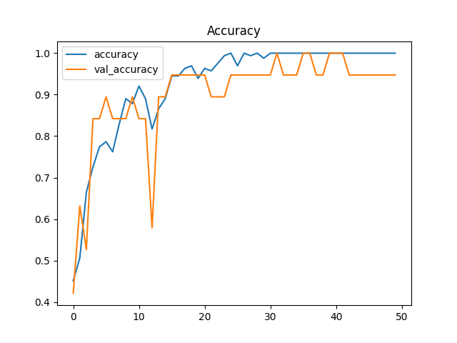

# Model description

The model files and figures are stored in the folder /models. The following chapters provide a detailed description of each model. The most recent test/model is presented in the first chapter, with older tests described in subsequent chapters further down this README.

## test3
Suggestions for improvements due to overfitting:
 - Try 128 neurons in the last conv layer and the dense layer. (might be too large with 256 with such small dataset).
 - I can try with batch size 16 or 64, but not sure if i will do it in this section.
 - Maxpooling with strides = None, which has no overlapping (might wait wit this aswell)
 - Adjust L2 regularization, Sometimes 0.001 works better than 0.01-.
 

## test2
I segmented the data once again because there was some audio files which didnt have audio all the way through the 1s wav files. 

### Configuration
- **Epochs** =  50
- **Batch_size** = 32
- **model** = Sequential()

### CNN Architecture

**Layer 1**
```python
model.add(Conv2D(32, (3, 3), input_shape=input_shape, padding='same'))
model.add(Activation("relu"))
model.add(MaxPooling2D(pool_size=(2, 2))) 
```
**Layer 2**
```python
model.add(Conv2D(64, (3, 3), padding='same'))
model.add(Activation("relu"))
model.add(MaxPooling2D(pool_size=(3, 3), strides=(2, 2), padding='same'))
```
**Layer 3**
```python
model.add(Conv2D(128, (3, 3), padding='same'))
model.add(Activation("relu"))
model.add(MaxPooling2D(pool_size=(3, 3), strides=(2, 2), padding='same'))
```
**Layer 4**
```python
model.add(Conv2D(256, (3, 3), padding='same'))
model.add(Activation("relu"))
model.add(MaxPooling2D(pool_size=(3, 3), strides=(2, 2), padding='same'))
```
**Dense Layer**
```python
model.add(Flatten())

model.add(Dense(256, kernel_regularizer=l2(0.01)))
model.add(Activation("relu"))
model.add(Dropout(0.4))  
```
**Output Layer**
```python
model.add(Dense(1, kernel_regularizer=l2(0.01)))
model.add(Activation("sigmoid"))
```

### Result
Ouput prediction on test et was 100%.
Spikes and variability in accuracy especially in earlier epochs might indicate instability in the model's performance.
The nearly perfect accuracy on the training set, combined with the fluctuations in validation accuracy and loss, may suggest overfitting. This means your model has learned the training data too well and may not generalize perfectly to unseen data.

The results of this Model is aqually quite good when tested on new data.
However it struggles to identify "silent" nopoping audio as nopop. which is fair because it isn't included in the test data.
I suggest using the same model parameters to retrain a model on data which include nonpoping data without a high amplitude.

Accuracy                                  |  Loss
:----------------------------------------:|:-------------------------:
  | 
